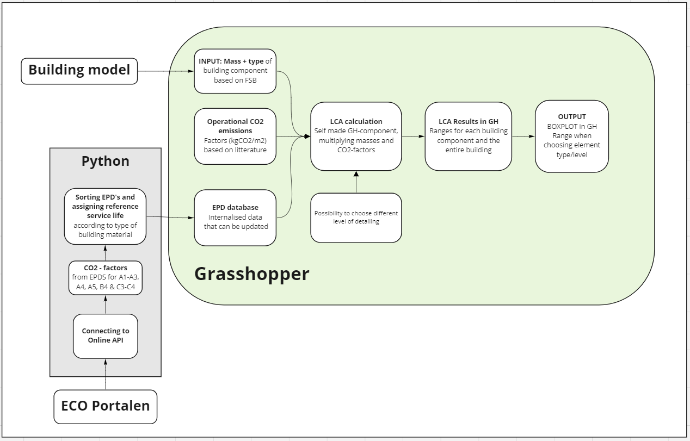
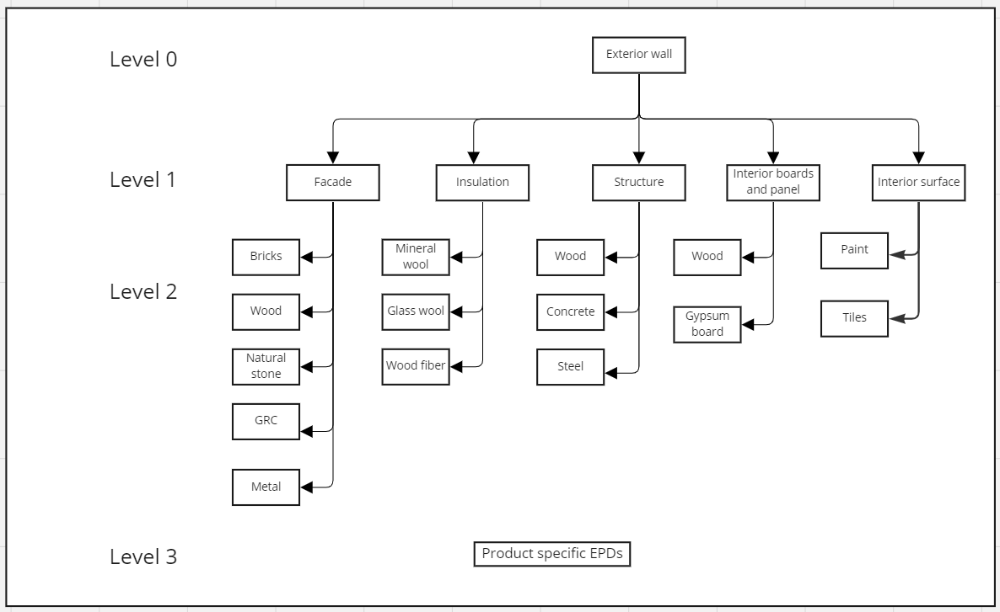

[![AGPL License][license-shield]][license-url]

<br />
<div align="center">
<h3 align="center">Parametric Life-Cycle Assessment in Early-stage Building Design</h3>
  <p align="center">
    Tool for flexible LCA analysis of buildings
    <br />
    <a href="https://github.com/NajaJohansen/GrassHopper_Course"><strong>Explore the docs »</strong></a>
    <br />
    <br />
    <a href="https://github.com/NajaJohansen/GrassHopper_Course/pulls">Pull requests</a>
    ·
    <a href="https://github.com/NajaJohansen/GrassHopper_Course/issues">Elaboration of unsolved issues</a>
  </p>
</div>
<!-- TABLE OF CONTENTS -->
<details>
  <summary>Table of Contents</summary>
  <ol>
    <li>
      <a href="#about-the-project">About The Project</a>
      <ul>
        <li><a href="#Existing">Existing LCA tools</a></li>
        <li><a href="#Requesting">Requesting EPD data via API</a></li>
         <li><a href="#Requesting">Categorization of EPDs</a></li>
      </ul>
    </li>
    <li>
      <a href="#getting-started">Getting Started</a>
      <ul>
        <li><a href="#prerequisites">Prerequisites</a></li>
      </ul>
    </li>
    <li><a href="#usage">Concept</a></li>
    <li><a href="#usage">Usage specifications</a></li>
      <ul>
        <li><a href="#Existing">Usage of Grasshopper script</a></li>
        <li><a href="#Requesting">Usage of Python scripts</a></li>
      </ul>
    <li><a href="#roadmap">Creators</a></li>
    <li><a href="#contributing">Contributing</a></li>
    <li><a href="#license">License</a></li>
  </ol>
</details>

<!-- ABOUT THE PROJECT -->
## About The Project
The project has been performed by 6 master students as part of a 5 ECTS point course at the Technical University of 
Denmark (DTU). The project started with the idea that by conveying LCA results with a range instead of a single number, 
designers are to a greater extent made aware of the impact of their decisions. This will help integrate sustainable 
thinking into the early stage of building design. Further, the data should be based on project specific EPD’s instead 
of generic data. 

The project had the following goals: 
1.	Investigate the market of LCA tools and figure out strength and shortcomings of a selection of existing tools and carry out interviews with industry experts.
2.	Create an EPD search engine in python that can connect with ECO Portal through an API and produce a library of EPDs with their characterization factors for Global Warming Potential (GWP), lifetime, density, and functional unit.
3.	Use existing categorizing system from the different EPD operators to categorize the EPDs depending on which type of product they describe and which type of component they can be a part of. 
4.	Create a grasshopper script that can sort and quantify building components and relate them to EPDs that are relevant for the components. The CO2 impacts of the different components and the entire building can then be calculated as ranges of varied materials combinations in the components.
5.	Visualize the results as boxplot that indicates the range of possible CO2 impact of a building, depending on the material choices.

### Existing LCA tools
The project started with a dive into five LCA tools that were developed for different software and for various stages 
of the building design, from early stage to documentation in planning stage. In the folder 
[Flowcharts](figures/Flowcharts) of the workflow with different LCA tools are located. 
The flowchart is based on our expression of the tools and are not crosschecked 
with the developers of the tool. The LCA tools that have been examined is: 
- DesignLCA, developed by Graphisoft and with input from Lenager group. The tool is made for Archicad and gives live results and has implemented a simple energy calculator. The user has to manually assign CO2 data to the materials or use a library with predefined constructions.
- LCA Platform, developed by Arkitema and COWI. The tool is divided in two; LCA documentation and LCA design. LCA documentation is for documentation behind the final LCA of project. It is going to be a mutual platform for the Danish building industry, which aim is to secure that across companies the LCA, they are performing have the same level of documentation. The tool can create a JSON file that ca be used in LCAbyg. The other tool; LCA Design is developed for Revit, gives live results in a browser window. 
- CardinalLCA is developed by J. Chen, K. Kharbanda and H Loganathan as a plugin for Grasshopper. The tool is designed for early stage LCA and gives live results and visualizations in Rhino. The users can assign materials for the building geometry through the EC3 database or the ICE database. Here they have the option to choose specific data or to create average data. The average data can be found through different filters e.g. by geographical scope.
- ACT – A Carbon Tool, created for Speckle by [Arup](https://act.speckle.arup.com/about). It is a very simple tool reading the ifc model of the building from Speckle and allowing you to add specific LCA data to the ifc types.
- LCA:ARK, developed by C.F. Møller and is essentially a grasshopper script. The script can extract quantify the masses of various building components from a rhino model and user can assign different predefined solutions to the component. The script can create a JSON file that can be used in LCAbyg. 

A variety of tools have been developed to ease LCA calculations. They have different strengths and shortcomings. 
The clear strength of Design LCA, ACT and Cardinal LCA is that they are free whereas the other tools requires that you 
buy a license or make an agreement with the developers. CardinalLCA is unfortunately no longer maintained and one of 
the databases behind it is not properly working. ACT requires knowledge of the workflow behind Speckle and gives some
very rough calculations since it is build on ifc, which is not so robust for LCA. 
Design LCA is quite intuitive to use, but the mapping of materials requires some work. 
The tools DesignLCA, LCA Design, Cardinal LCA, ACT and LCA:ARK is all for early-stage design. 
In the early stage many decisions about the building materials are either not taken or unsure, thus conveying 
the result of the LCA as an interval is a great way to illustrate that uncertainty, thus we have chosen that 
the results from our tool should be represented as ranges. Cardinal LCA and LCA:ARK convey the results in this way. 
Our tool is differentiated from LCA:ARK by being open source and based on EPD, whereas LCA:ARK used the database 
OEKOBAU, with the possibility of implementing EPDs. CardinalLCA is based upon an American database and a British 
database, where the aim with our tools is to have access to the database of various EPD database operators. 

### Requesting EPD data via API
A large part of this project is about getting the EPD data digitally, which is possible through 
[ECO Portal](https://www.eco-platform.org/eco-portal-api-register.html) from ECO Platform. ECO platform is cooperating
with meny different EPD providers from different countries. The EPDs from these providers are digitalized to follow the 
ILCD+EPD format developed on EU level to secure uniform EPD data. This is an XML-based format, which can be converted to
json as used in this project. ECO Portal has an online search engine to look up and download EPDs, but they also have 
and API from which the EPD data can be requested and processed in your code. All that is needed it to
[create and account](https://data.eco-platform.org/static/doc/ECO_Portal_API_Howto_Obtain_a_Token.pdf) and obtain a 
token, which can be used to get the data for free. In this project we have used Python to get the data using
[Requests](https://requests.readthedocs.io/en/latest/#). The same is possible to do for OKOBAU but this has not been
solved in this projects yes. See the issues.

### Grasshopper script
Within the Grasshopper script different building quantities are collected from the 3D model. In this case a parametric 
building model is created for retrieving the building component quantities. It could however also be a Rhino model split
into component layers. The Rhino model include quantities for the following components:	

- Foundation
- Terrain
- Floor slabs
- Roofing
- Exterior wall
- Windows
- Exterior door
- Interior wall
- Interior door
- Columns
- Beams


Hereafter, all the EPDs are imported from an Excel file. In total 265 EPDs are included, however this could be further 
expanded. The data is sorted and rows with no values are removed. Items with no end of life-scenario (C3-C4) are 
removed. Replacements are added in B4 based on the product lifetime compared with the building lifetime (default 
is 50 years as in the Danish building regulations). If the product lifetime is shorter than the building lifetime, 
B4 is calculated based on A1-A3 and C3-C4. If A4 and A5 are not included for the items, they are calculated based 
on weight and a default distance of transportation of 500 km or a waste factor for A4 and A5 respectively. At last, 
the data is sorted in the different building components. 
Each building component is sorted in its subcategories, which for example for an exterior wall would be façade, 
insulation, interior boards and panels, interior surface, and structure. Within each of these subcategories, 
‘Items Selectors’ allows for the EPD data to be narrowed down as it possible to choose from different overall 
materials (for example glass wool, stone wool, and wood fiber for insulation). Based on this selection, only 
the EPDs within this material choice are included. If further precision is wanted, specific product EPD’s can be 
chosen as well. 
As all possibilities are included from the beginning, this creates a large amount of possible building components 
(for example 269,748 different possibilities for the exterior wall). If all components are added together, it would 
create a total of 2.9E+21 possibilities and result in a incredible slow computational process. To reduce this, only 
the minimum, median and maximum values are found for all the combinations and are matched. This way only three values 
for each building component is required, resulting in a total of 59,049 possibilities and a faster use of the script.  
Of course, this is a simplification of the actual results and the final building boxplot would therefore have been 
different if all possibilities were included, however it is estimated that the computational time would be way to 
high for actual use of the script. 
The data is collected in a tree, which is connected to a boxplot component from DecodingSpaces (requires R 3.4.4) and 
an Item Selector. The desired output is selected from the Item Selector and the output is shown in separate view 
(if ‘True’). DecodingSpaces allows for multiple types of plots, which can be added for more functionality. 
Currently, boxplot only works for one building component at a time or the full building.
Another possibility for visualization of the LCA results is to use Hops Plot-it / Seaborn Grasshopper: 
https://github.com/MaesAntoine/Hops_plots by Antoine Maes 
https://github.com/monsieurpablo/seaborn_grasshopper by Juan Pablo Arango 
This option uses Rhino ‘Hops’, which was explored and fixed the issue of only showing one boxplot at a time. 
The data was split into ‘Full Building’ and ‘Building Components’, showing all the relevant boxplots in the same view. However, it was difficult to make this work on different pc’s from the one where it was originally set up and thus not implemented in the final script. 


### Categorization of EPDs
To use the different EPDs it is necessary to categorize them to match the different building components as well as 
the product types within these components and material types within the products. For example, the building component 
“exterior wall” has the lower levelled products; “façade”, “insulation”, “structure”, “interior board” and 
“interior surface”. Within these lower levelled products several material types are defined. E.g., the product “façade” 
has the material options “brick”, “wood”, “stone” etc. These categorization classifications are essential to structure 
the data subtracted from the EPDs into relevant groups. The level structure for exterior walls can be seen in 
[category diagram](figures/Levels_categories.png).
Though, the current EPDs are structured differently depending on the EPD operator (e.g., IBU – Institute Baum und 
Umwelt, EPD Denmark etc.). Within the ECO Portal the categorizations are adopted form the respective operator, which 
creates issues due to the categorization not being streamlined and equally elaborated. To reach the fully potential 
of this project these categorizations must be comparable and well-defined across all the different EPD programs. 
This definition is already in process. The EPD operators contributing to the ECO Platform agreed to work on a 
harmonization of among others the Product Category Rules (PCR). This might result in possibility of fulfilling the 
project’s goal further in the future.
However, for now it was necessary to split the project into two branches. One where the relevant EPDs are collected 
via the API and distributed into the wanted categories, and another branch that creates the wanted LCA ranged output from a 3D model. 
As a proof of concept an excel file was made to show the outcome from the LCA script in grasshopper. 
In this file the desired structure of the EPDs were defined. In this excel file  265 EPDs were summarized 
into building components, products, and materials to be used in the script.  


<!-- GETTING STARTED -->
## Getting Started
This project can be approached as one large project or two smaller, the Grasshopper part and the Python part, which 
can be worked with individually. Prerequisites 2 to 5 are for running the Python code, while the rest are for running
the Grasshopper script. 

### Prerequisites
1. Clone the repo
   ```sh
   git clone https://github.com/NajaJohansen/GrassHopper_Course.git
   ```
2. Install Python version 3.10
3. For python install requests
   ```sh
   $ python -m pip install requests
   ```
4. [Register](https://data.eco-platform.org/registration.xhtml) for a ECO Portal user account or follow [this guide](https://data.eco-platform.org/static/doc/ECO_Portal_API_Howto_Obtain_a_Token.pdf)
5. [Create a token](https://data.eco-platform.org/static/doc/ECO_Portal_API_Howto_Obtain_a_Token.pdf) for access to use the API
6. Install Rhino and Grasshopper
7. For Grasshopper get DecondingSpaces Toolbox
8. for Grasshopper get R 3.4.4


<!-- CONCEPT -->
## Concept





<!-- USAGE SPECIFICATIONS -->
## Usage specifications
Here are some practical tips for using the scripts and code and what you should be aware of.

### Usage of Grasshopper script
For the visualization of results the boxplot-component from the 
[DecodingSpaces Toolbox](https://toolbox.decodingspaces.net/) is used. To use these components R 3.4.4 is also required.  
The ‘toggle’ should be put to true and results for the different building 
components are selected through the drop-down menu ‘Item selector’. 

### Usage of python scripts
It is important to add your ECO Portal token to be allowed access to get the data. In [main.py](main.py) the following 
line is where you should insert the token, when you have obtained it.
   ```sh
   token = 'Bearer *INSERT YOUR TOKEN HERE*'
   ```
The overall purpose of the Python scripts is to get the EPD data, sort it, find the data needed and save it as a csv
file, which can be used as a database in the Grasshopper script. 

[main.py](main.py) is where the get requests are made and all the functions are called. Two steps of get requests are 
made, first the request to ECO Portal getting information on which EPDs are available. Parameters can be added here
to sort which types of EPDs you are looking for. Note that the parameter pageSize determines how many EPDs to get, start
 low when testing. In the first step requests you will get the urls needed for the second step to request the actual 
EPD data in the ILCD+EPD format. For further details on how the API works see the 
[Eco Portal documentation](https://data.eco-platform.org/static/doc/ECO_Portal_API_-_Quickstart_Guide.pdf).

For each EPD the specific data points are found in the data structure and added to the lists that will be turned into
csv at the end. During the process of finding the datapoints, the data is sorted to match what we are looking for. 
Even though the point of the ILCD+EPD format is to have uniform data, there is a lot of issues with the actual data. 
We have chosen to sort away the EPDs that "bad data", which does not fit into our categories, do not have proper 
functional units or sufficient stages. This leaves space for a lot of improvement to how many EPDs can be handled by
the code. [Level2_function.py](Level2_function.py) contains the functions that look up the datapoints in the ILCD 
format. The format is quite complicated, so it is recommended to dive a bit into it and get familiar with it. The data
is in json format which allows us to find the datapoints via the keys in the dictionary. Some of these key are quite 
long and complicated, so it is important to make sure that they are typen in correctly. Another issue here is that 
following the same keys did not work for all EPDs, which might require a lot of single case handling. 

[functions.py](functions.py) contains helper functions that deal with issues in the data. 

[export.py](export.py) contains the functions to export the gathered data to csv and json respectively.

[okobau_test.py](okobau_test.py) contains the startup of getting data from OKOBAU. But this script does not work and 
would be a good place to start of wanting to contribute to this project.

[categories.json](categories.json) contains the categories for exterior walls used in this project. This takes the IBU 
categories and translate them into our own categories. This one will need to be extended as more categories are 
added.


<!-- CREATORS -->
## Creators
- Andreas Sode Vest
- Lærke Vejsnæs
- Naja Johansen
- Anna Kristina Schjerbeck
- Christian Oettinger
- Manja Nørrekær Lund

<!-- CONTRIBUTING -->
## Contributing
This project can be the beginning of a larger project with a lot of potential. 
We therefore strongly encourage further work,
which can help develop the project and make EPD data more available. 
You are welcome to create a [pull request](https://github.com/NajaJohansen/GrassHopper_Course/pulls) or 
[create a new fork](https://github.com/NajaJohansen/GrassHopper_Course/fork).
If you want a good place to start then take a look at the 
[issues](https://github.com/NajaJohansen/GrassHopper_Course/issues) or see where to 
[contribute](https://github.com/NajaJohansen/GrassHopper_Course/contribute). If you do contribute, please share your
great work, so we can build a great projects together.

<!-- LICENSE -->
## License
Distributed under the AGPL License. See [LICENSE.md](LICENSE.md) for more information.


<!-- MARKDOWN LINKS & IMAGES -->
<!-- https://www.markdownguide.org/basic-syntax/#reference-style-links -->
[contributors-shield]: https://img.shields.io/github/contributors/github_username/repo_name.svg?style=for-the-badge
[contributors-url]: https://github.com/NajaJohansen/GrassHopper_Course/contribute
[forks-shield]: https://img.shields.io/github/forks/github_username/repo_name.svg?style=for-the-badge
[forks-url]: https://github.com/NajaJohansen/GrassHopper_Course/fork
[stars-shield]: https://img.shields.io/github/stars/github_username/repo_name.svg?style=for-the-badge
[stars-url]: https://github.com/NajaJohansen/GrassHopper_Course/stargazers
[issues-shield]: https://img.shields.io/github/issues/github_username/repo_name.svg?style=for-the-badge
[issues-url]: https://github.com/NajaJohansen/GrassHopper_Course/issues
[license-shield]: https://img.shields.io/badge/LICENSE-GNU%20AGPL-lightgrey?style=for-the-badge&logo=gnu
[license-url]: https://www.gnu.org/licenses/agpl-3.0.en.html

